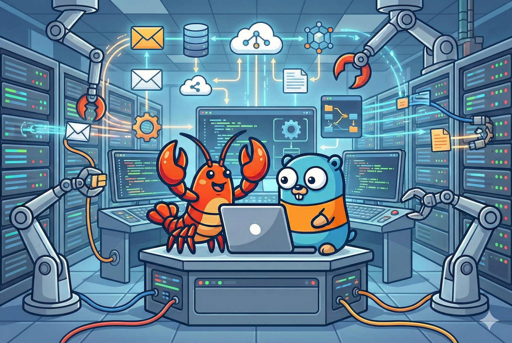

<p align="center">
  
</p>

<h1 align="center">GoClaw</h1>

<p align="center"><strong>Enterprise AI Agent Platform</strong></p>

<p align="center">
Multi-agent AI gateway built in Go. 20+ LLM providers. 7 channels. Multi-tenant PostgreSQL.<br/>
Single binary. Production-tested. Agents that orchestrate for you.
</p>

<p align="center">
  <a href="https://docs.goclaw.sh">Dokumentasjon</a> •
  <a href="https://docs.goclaw.sh/#quick-start">Hurtigstart</a> •
  <a href="https://x.com/nlb_io">Twitter / X</a>
</p>

<p align="center">
  <a href="https://go.dev/"></a>
  <a href="https://www.postgresql.org/"></a>
  <a href="https://www.docker.com/"></a>
  <a href="https://developer.mozilla.org/en-US/docs/Web/API/WebSocket"></a>
  <a href="https://opentelemetry.io/"></a>
  <a href="https://www.anthropic.com/"></a>
  <a href="https://openai.com/"></a>
  
</p>

**GoClaw** er en AI-gateway for flere agenter som kobler LLM-er til verktøyene, kanalene og dataene dine — distribuert som én enkelt Go-binærfil uten kjøretidsavhengigheter. Den orkestrerer agentteam og delegering mellom agenter på tvers av 20+ LLM-leverandører med full flerleietaker-isolasjon.

En Go-port av [OpenClaw](https://github.com/openclaw/openclaw) med forbedret sikkerhet, flerleietaker PostgreSQL og produksjonsklar observerbarhet.

🌐 **Språk:**
[🇺🇸 English](../README.md) ·
[🇨🇳 简体中文](README.zh-CN.md) ·
[🇯🇵 日本語](README.ja.md) ·
[🇰🇷 한국어](README.ko.md) ·
[🇻🇳 Tiếng Việt](README.vi.md) ·
[🇵🇭 Tagalog](README.tl.md) ·
[🇪🇸 Español](README.es.md) ·
[🇧🇷 Português](README.pt.md) ·
[🇮🇹 Italiano](README.it.md) ·
[🇩🇪 Deutsch](README.de.md) ·
[🇫🇷 Français](README.fr.md) ·
[🇸🇦 العربية](README.ar.md) ·
[🇮🇳 हिन्दी](README.hi.md) ·
[🇷🇺 Русский](README.ru.md) ·
[🇧🇩 বাংলা](README.bn.md) ·
[🇮🇱 עברית](README.he.md) ·
[🇵🇱 Polski](README.pl.md) ·
[🇨🇿 Čeština](README.cs.md) ·
[🇳🇱 Nederlands](README.nl.md) ·
[🇹🇷 Türkçe](README.tr.md) ·
[🇺🇦 Українська](README.uk.md) ·
[🇮🇩 Bahasa Indonesia](README.id.md) ·
[🇹🇭 ไทย](README.th.md) ·
[🇵🇰 اردو](README.ur.md) ·
[🇷🇴 Română](README.ro.md) ·
[🇸🇪 Svenska](README.sv.md) ·
[🇬🇷 Ελληνικά](README.el.md) ·
[🇭🇺 Magyar](README.hu.md) ·
[🇫🇮 Suomi](README.fi.md) ·
[🇩🇰 Dansk](README.da.md) ·
[🇳🇴 Norsk](README.nb.md)

## Hva gjør det annerledes

- **Agentteam og orkestrering** — Team med delte oppgavetavler, delegering mellom agenter (synkron/asynkron) og hybrid agentoppdagelse
- **Flerleietaker PostgreSQL** — Arbeidsområde per bruker, kontekstfiler per bruker, krypterte API-nøkler (AES-256-GCM), isolerte sesjoner
- **Én enkelt binærfil** — ~25 MB statisk Go-binær, ingen Node.js-kjøretid, <1s oppstartstid, kjører på en $5 VPS
- **Produksjonssikkerhet** — 5-lags tillatelsessystem (gateway-autentisering → global verktøypolicy → per agent → per kanal → kun eier) pluss hastighetsbegrensning, deteksjon av prompt-injeksjon, SSRF-beskyttelse, avvisningsmønstre for skall og AES-256-GCM-kryptering
- **20+ LLM-leverandører** — Anthropic (innebygd HTTP+SSE med prompt-mellomlagring), OpenAI, OpenRouter, Groq, DeepSeek, Gemini, Mistral, xAI, MiniMax, Cohere, Perplexity, DashScope, Bailian, Zai, Ollama, Ollama Cloud, Claude CLI, Codex, ACP og ethvert OpenAI-kompatibelt endepunkt
- **7 meldingskanaler** — Telegram, Discord, Slack, Zalo OA, Zalo Personal, Feishu/Lark, WhatsApp
- **Extended Thinking** — Tenkningsmodus per leverandør (Anthropic budsjett-tokens, OpenAI resonneringsintensitet, DashScope tenkningsbudsjett) med strømmestøtte
- **Heartbeat** — Periodiske agentsjekker via HEARTBEAT.md-sjekklister med undertrykking ved OK, aktive timer, logikk for nye forsøk og kanalleveranse
- **Planlegging og cron** — `at`-, `every`- og cron-uttrykk for automatiserte agentoppgaver med banebasert samtidighet
- **Observerbarhet** — Innebygd sporing av LLM-kall med spenn og måledata for prompt-mellomlagring, valgfri OpenTelemetry OTLP-eksport

## Claw-økosystemet

|                 | OpenClaw        | ZeroClaw | PicoClaw | **GoClaw**                              |
| --------------- | --------------- | -------- | -------- | --------------------------------------- |
| Språk           | TypeScript      | Rust     | Go       | **Go**                                  |
| Binærstørrelse  | 28 MB + Node.js | 3.4 MB   | ~8 MB    | **~25 MB** (base) / **~36 MB** (+ OTel) |
| Docker-bilde    | —               | —        | —        | **~50 MB** (Alpine)                     |
| RAM (inaktiv)   | > 1 GB          | < 5 MB   | < 10 MB  | **~35 MB**                              |
| Oppstart        | > 5 s           | < 10 ms  | < 1 s    | **< 1 s**                               |
| Målmaskinvare   | $599+ Mac Mini  | $10 edge | $10 edge | **$5 VPS+**                             |

| Funksjon                    | OpenClaw                             | ZeroClaw                                     | PicoClaw                              | **GoClaw**                     |
| -------------------------- | ------------------------------------ | -------------------------------------------- | ------------------------------------- | ------------------------------ |
| Flerleietaker (PostgreSQL)  | —                                    | —                                            | —                                     | ✅                             |
| MCP-integrasjon            | — (bruker ACP)                       | —                                            | —                                     | ✅ (stdio/SSE/streamable-http) |
| Agentteam                  | —                                    | —                                            | —                                     | ✅ Oppgavetavle + postboks     |
| Sikkerhetsherdning          | ✅ (SSRF, banetraversering, injeksjon) | ✅ (sandbox, hastighetsbegrensning, injeksjon, paring) | Grunnleggende (arbeidsområdebegrensning, exec-avvisning) | ✅ 5-lags forsvar             |
| OTel-observerbarhet         | ✅ (valgfri utvidelse)               | ✅ (Prometheus + OTLP)                       | —                                     | ✅ OTLP (valgfritt build-tag)  |
| Prompt-mellomlagring        | —                                    | —                                            | —                                     | ✅ Anthropic + OpenAI-compat   |
| Kunnskapsgraf               | —                                    | —                                            | —                                     | ✅ LLM-uttrekk + traversering  |
| Ferdighetssystem            | ✅ Innbygging/semantisk              | ✅ SKILL.md + TOML                           | ✅ Grunnleggende                      | ✅ BM25 + pgvector hybrid      |
| Banebasert planlegger       | ✅                                   | Begrenset samtidighet                        | —                                     | ✅ (main/subagent/team/cron)   |
| Meldingskanaler             | 37+                                  | 15+                                          | 10+                                   | 7+                             |
| Følgeapper                  | macOS, iOS, Android                  | Python SDK                                   | —                                     | Web-dashbord                   |
| Live Canvas / Tale          | ✅ (A2UI + TTS/STT)                  | —                                            | Taletranskripsjoner                   | TTS (4 leverandører)           |
| LLM-leverandører            | 10+                                  | 8 innebygde + 29 compat                      | 13+                                   | **20+**                        |
| Arbeidsområde per bruker    | ✅ (filbasert)                       | —                                            | —                                     | ✅ (PostgreSQL)                |
| Krypterte hemmeligheter     | — (kun env-variabler)                | ✅ ChaCha20-Poly1305                         | — (ren JSON)                          | ✅ AES-256-GCM i DB            |

## Arkitektur

<p align="center">
  
</p>

## Hurtigstart

**Forutsetninger:** Go 1.26+, PostgreSQL 18 med pgvector, Docker (valgfritt)

### Fra kildekode

```bash
git clone https://github.com/nextlevelbuilder/goclaw.git && cd goclaw
make build
./goclaw onboard        # Interaktiv oppsettsveiviser
source .env.local && ./goclaw
```

### Med Docker

```bash
# Generer .env med automatisk genererte hemmeligheter
chmod +x prepare-env.sh && ./prepare-env.sh

# Legg til minst én GOCLAW_*_API_KEY i .env, deretter:
make up

# Web-dashbord på http://localhost:18790
# Helsesjekk: curl http://localhost:18790/health
```

Når `GOCLAW_*_API_KEY`-miljøvariabler er satt, registrerer gatewayen seg automatisk uten interaktive spørsmål — oppdager leverandør, kjører migrasjoner og fyller inn standarddata.

> For byggevarianter (OTel, Tailscale, Redis), Docker-bildekoder og compose-overlegg, se [Distribusjonsveiledningen](https://docs.goclaw.sh/#deploy-docker-compose).

## Fler-agent-orkestrering

GoClaw støtter agentteam og delegering mellom agenter — hver agent kjører med sin egen identitet, verktøy, LLM-leverandør og kontekstfiler.

### Agentdelegering

<p align="center">
  
</p>

| Modus | Slik fungerer det | Best for |
|-------|------------------|----------|
| **Synkron** | Agent A spør Agent B og **venter** på svar | Raske oppslag, faktasjekker |
| **Asynkron** | Agent A spør Agent B og **fortsetter**. B kunngjør senere | Lange oppgaver, rapporter, dybdeanalyse |

Agenter kommuniserer gjennom eksplisitte **tillatelseslenker** med retningskontroll (`outbound`, `inbound`, `bidirectional`) og grenser for samtidighet på både lenke- og agentnivå.

### Agentteam

<p align="center">
  
</p>

- **Delt oppgavetavle** — Opprett, gjør krav på, fullfør og søk i oppgaver med `blocked_by`-avhengigheter
- **Team-postboks** — Direkte meldinger mellom agenter og kringkasting
- **Verktøy**: `team_tasks` for oppgaveadministrasjon, `team_message` for postboks

> For detaljer om delegering, tillatelseslenker og samtidige grenser, se [dokumentasjonen for agentteam](https://docs.goclaw.sh/#teams-what-are-teams).

## Innebygde verktøy

| Verktøy             | Gruppe        | Beskrivelse                                                  |
| ------------------- | ------------- | ------------------------------------------------------------ |
| `read_file`         | fs            | Les filinnhold (med virtuell FS-ruting)                      |
| `write_file`        | fs            | Skriv/opprett filer                                          |
| `edit_file`         | fs            | Bruk målrettede redigeringer på eksisterende filer           |
| `list_files`        | fs            | List opp innholdet i en mappe                                |
| `search`            | fs            | Søk i filinnhold etter mønster                               |
| `glob`              | fs            | Finn filer etter glob-mønster                                |
| `exec`              | runtime       | Kjør skallkommandoer (med godkjenningsarbeidsflyt)           |
| `web_search`        | web           | Søk på nettet (Brave, DuckDuckGo)                            |
| `web_fetch`         | web           | Hent og analyser nettinnhold                                 |
| `memory_search`     | memory        | Søk i langtidsminne (FTS + vektor)                           |
| `memory_get`        | memory        | Hent minneoppføringer                                        |
| `skill_search`      | —             | Søk i ferdigheter (BM25 + innbygging hybrid)                 |
| `knowledge_graph_search` | memory  | Søk i entiteter og traverser kunnskapsgraf-relasjoner        |
| `create_image`      | media         | Bildegenerering (DashScope, MiniMax)                         |
| `create_audio`      | media         | Lydfil-generering (OpenAI, ElevenLabs, MiniMax, Suno)        |
| `create_video`      | media         | Videogenerering (MiniMax, Veo)                               |
| `read_document`     | media         | Dokumentlesing (Gemini File API, leverandørkjede)            |
| `read_image`        | media         | Bildeanalyse                                                 |
| `read_audio`        | media         | Lydtranskribering og analyse                                 |
| `read_video`        | media         | Videoanalyse                                                 |
| `message`           | messaging     | Send meldinger til kanaler                                   |
| `tts`               | —             | Tekst-til-tale-syntese                                       |
| `spawn`             | —             | Start en underagent                                          |
| `subagents`         | sessions      | Kontroller kjørende underagenter                             |
| `team_tasks`        | teams         | Delt oppgavetavle (list, opprett, gjør krav på, fullfør, søk)|
| `team_message`      | teams         | Team-postboks (send, kringkast, les)                         |
| `sessions_list`     | sessions      | List aktive sesjoner                                         |
| `sessions_history`  | sessions      | Vis sesjonshistorikk                                         |
| `sessions_send`     | sessions      | Send melding til en sesjon                                   |
| `sessions_spawn`    | sessions      | Start en ny sesjon                                           |
| `session_status`    | sessions      | Sjekk sesjonsstatus                                          |
| `cron`              | automation    | Planlegg og administrer cron-jobber                          |
| `gateway`           | automation    | Gateway-administrasjon                                       |
| `browser`           | ui            | Nettleserautomatisering (naviger, klikk, skriv, skjermbilde) |
| `announce_queue`    | automation    | Asynkron kunngjøring av resultater (for asynkron delegering) |

## Dokumentasjon

Fullstendig dokumentasjon på **[docs.goclaw.sh](https://docs.goclaw.sh)** — eller bla gjennom kilden i [`goclaw-docs/`](https://github.com/nextlevelbuilder/goclaw-docs)

| Seksjon | Emner |
|---------|-------|
| [Kom i gang](https://docs.goclaw.sh/#what-is-goclaw) | Installasjon, hurtigstart, konfigurasjon, web-dashbord-omvisning |
| [Kjernekonsepter](https://docs.goclaw.sh/#how-goclaw-works) | Agentløkke, sesjoner, verktøy, minne, flerleietaker |
| [Agenter](https://docs.goclaw.sh/#creating-agents) | Opprette agenter, kontekstfiler, personlighet, deling og tilgang |
| [Leverandører](https://docs.goclaw.sh/#providers-overview) | Anthropic, OpenAI, OpenRouter, Gemini, DeepSeek, +15 flere |
| [Kanaler](https://docs.goclaw.sh/#channels-overview) | Telegram, Discord, Slack, Feishu, Zalo, WhatsApp, WebSocket |
| [Agentteam](https://docs.goclaw.sh/#teams-what-are-teams) | Team, oppgavetavle, meldinger, delegering og overlevering |
| [Avansert](https://docs.goclaw.sh/#custom-tools) | Egendefinerte verktøy, MCP, ferdigheter, cron, sandbox, kroker, RBAC |
| [Distribusjon](https://docs.goclaw.sh/#deploy-docker-compose) | Docker Compose, database, sikkerhet, observerbarhet, Tailscale |
| [Referanse](https://docs.goclaw.sh/#cli-commands) | CLI-kommandoer, REST API, WebSocket-protokoll, miljøvariabler |

## Testing

```bash
go test ./...                                    # Enhetstester
go test -v ./tests/integration/ -timeout 120s    # Integrasjonstester (krever kjørende gateway)
```

## Prosjektstatus

Se [CHANGELOG.md](CHANGELOG.md) for detaljert funksjonsstatus, inkludert hva som er testet i produksjon og hva som fremdeles pågår.

## Anerkjennelser

GoClaw er bygd på det opprinnelige [OpenClaw](https://github.com/openclaw/openclaw)-prosjektet. Vi er takknemlige for arkitekturen og visjonen som inspirerte denne Go-porten.

## Lisens

MIT
