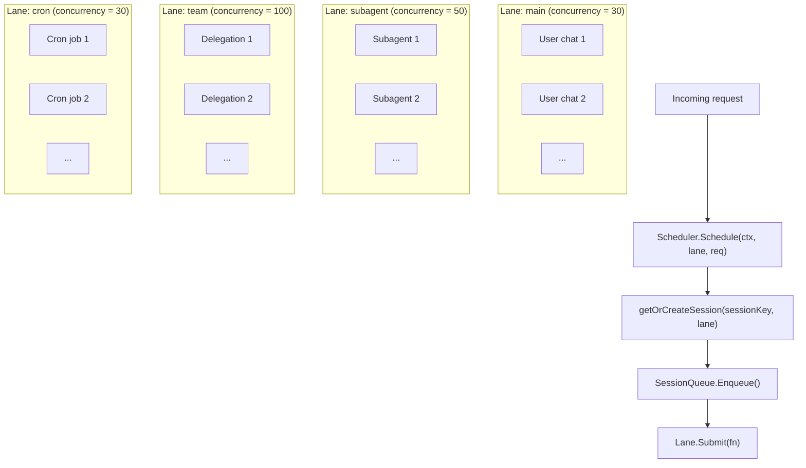
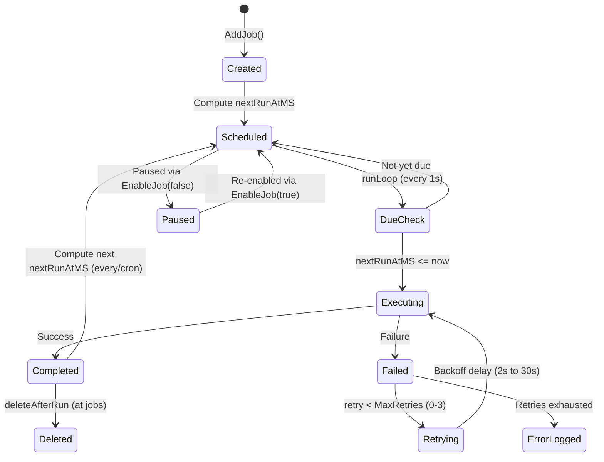

# 08 - Scheduling & Cron

Concurrency control and periodic task execution. The scheduler provides lane-based isolation and per-session serialization. Cron extends the agent loop with time-triggered behavior.

> Cron jobs and run logs are stored in the `cron_jobs` and `cron_run_logs` PostgreSQL tables. Cache invalidation propagates via the `cache:cron` event on the message bus.

### Responsibilities

- Scheduler: lane-based concurrency control, per-session message queue serialization
- Cron: three schedule kinds (at/every/cron), run logging, retry with exponential backoff

---

## 1. Scheduler Lanes

Named worker pools (semaphore-based) with configurable concurrency limits. Each lane processes requests independently. Unknown lane names fall back to the `main` lane.



### Lane Defaults

| Lane | Concurrency | Env Override | Purpose |
|------|:-----------:|-------------|---------|
| `main` | 30 | `GOCLAW_LANE_MAIN` | Primary user chat sessions |
| `subagent` | 50 | `GOCLAW_LANE_SUBAGENT` | Sub-agents spawned by the main agent |
| `team` | 100 | `GOCLAW_LANE_TEAM` | Agent team/delegation executions |
| `cron` | 30 | `GOCLAW_LANE_CRON` | Scheduled cron jobs (per-session serialization prevents same-job races) |

`GetOrCreate()` allows creating new lanes on demand with custom concurrency. All lane concurrency values are configurable via environment variables.

---

## 2. Session Queue

Each session key gets a dedicated queue that manages agent runs. The queue supports configurable concurrent runs per session and adaptive throttling.

### Concurrent Runs

The scheduler configuration defines a default `MaxConcurrent` value (typically 1 for serial execution). Per-request overrides are available via `ScheduleWithOpts()`:

| Context | `maxConcurrent` | Rationale |
|---------|:--------------:|-----------|
| DMs | 1 | Single-threaded per user (no interleaving) |
| Groups | 3+ | Multiple users can get responses in parallel |

Application code (not the scheduler) decides whether to override based on channel type.

**Adaptive throttle**: When session history exceeds 60% of the context window, concurrency automatically drops to 1 to prevent context window overflow. Controlled by optional `TokenEstimateFunc` callback set on the scheduler.

### Queue Modes

| Mode | Behavior |
|------|----------|
| `queue` (default) | FIFO -- messages wait until a run slot is available |
| `followup` | Same as `queue` -- messages are queued as follow-ups |
| `interrupt` | Cancel the active run, drain the queue, start the new message immediately |

### Drop Policies

When the queue reaches capacity, one of two drop policies applies.

| Policy | When Queue Is Full | Error Returned |
|--------|-------------------|----------------|
| `old` (default) | Drop the oldest queued message, add the new one | `ErrQueueDropped` |
| `new` | Reject the incoming message | `ErrQueueFull` |

### Queue Config Defaults

| Parameter | Default | Description |
|-----------|---------|-------------|
| `mode` | `queue` | Queue mode (queue, followup, interrupt) |
| `cap` | 10 | Maximum messages in the queue |
| `drop` | `old` | Drop policy when full (old or new) |
| `debounce_ms` | 800 | Collapse rapid messages within this window |

---

## 3. /stop and /stopall Commands

Cancel commands for Telegram and other channels.

| Command | Behavior |
|---------|----------|
| `/stop` | Cancel the oldest running task; others keep going |
| `/stopall` | Cancel all running tasks + drain the queue |

### Implementation Details

- **Debouncer bypass**: `/stop` and `/stopall` are intercepted before the 800ms debouncer to avoid being merged with the next user message
- **Cancel mechanism**: `SessionQueue.CancelOne()` (for `/stop`) and `SessionQueue.CancelAll()` (for `/stopall`) expose the cancel functions. Context cancellation propagates to the agent loop
- **Stale message skipping**: `/stopall` sets an abort cutoff timestamp. Messages enqueued before the cutoff are skipped on next scheduling, preventing old messages from running after an abort
- **Empty outbound**: On cancel, an empty outbound message is published to trigger cleanup (stop typing indicator, clear reactions)
- **Trace finalization**: When `ctx.Err() != nil`, trace finalization falls back to `context.Background()` for the final DB write. Status is set to `"cancelled"`
- **Context survival**: Context values (traceID, collector) survive cancellation -- only the Done channel fires
- **Background workers (ticker/cron) — tenant ctx injection required**: Jobs started from `context.Background()` carry no tenant. Before calling any tenant-scoped store method (e.g. `GetTeam`, `GetTask`, `GetByID`), the worker MUST inject `store.WithTenantID(ctx, tenantID)` derived from the row-level `tenant_id` (e.g. `RecoveredTaskInfo.TenantID`, `TeamTaskData.TenantID`). Callers must also nil-check returned entities — some stores (e.g. `PGTeamStore.GetTeam`) return `(nil, nil)` when tenant is missing rather than an error. See `internal/tasks/task_ticker.go` for the reference pattern
- **Generation counter**: Each `SessionQueue` tracks a generation counter. When reset (e.g., during SIGUSR1 in-process restart), old generations are ignored, preventing stale completions from interfering with new requests

---

## 4. Adaptive Concurrency Control

The scheduler can automatically reduce concurrency based on token usage. When a session's context history approaches the summary threshold (60% of context window), the effective `MaxConcurrent` is reduced to 1, enforcing serial execution to prevent overflow.

**Implementation:**
- Set via `Scheduler.SetTokenEstimateFunc(fn TokenEstimateFunc)`
- `TokenEstimateFunc` returns `(tokens int, contextWindow int)` for a session
- Checked in `SessionQueue.effectiveMaxConcurrent()` before starting new runs
- Does not affect already-running tasks, only gates new task starts

---

## 5. Cron Lifecycle

Scheduled tasks that run agent turns automatically. The run loop checks every second for due jobs.



### Schedule Types

| Type | Parameter | Example |
|------|-----------|---------|
| `at` | `atMs` (epoch ms) | Reminder at 3PM tomorrow, auto-deleted after execution |
| `every` | `everyMs` | Every 30 minutes (1,800,000 ms) |
| `cron` | `expr` (5-field) | `"0 9 * * 1-5"` (9AM on weekdays) |

### Job States

Jobs have an `Enabled` boolean flag. When `false`, the job is skipped during the due-job check. When re-enabled, the next run is recomputed. Run results are logged in-memory (last 200 entries) and persisted to the PostgreSQL `cron_run_logs` table. Job state changes propagate via the message bus cache invalidation (`cache:cron` event).

### Retry -- Exponential Backoff with Jitter

When a cron job execution fails, it's automatically retried with exponential backoff before being logged as an error.

| Parameter | Default |
|-----------|---------|
| MaxRetries | 3 |
| BaseDelay | 2 seconds |
| MaxDelay | 30 seconds |

**Formula**: `delay = min(base × 2^attempt, max) ± 25% jitter`

Example retry sequence: fail → wait 2s → retry → fail → wait 4s → retry → fail → wait 8s → retry → fail → wait 16s → stop.

Retries are transparent to the user; final run status (ok or error) is logged to the `cron_run_logs` table.

### v3 Agent Evolution Cron Jobs

Two background cron jobs manage agent evolution (v3):

| Job | Frequency | Purpose |
|-----|-----------|---------|
| **Suggestion Analysis** | Daily (1 min after startup, then every 24h) | Analyzes agents with `evolution_metrics` enabled, generates improvement suggestions |
| **Evaluation & Rollback** | Weekly (every 7 days) | Checks applied suggestions against quality guardrails, auto-rolls back degraded evolutions |

Both jobs run with 5-minute timeout and tenant-scoped context. Failed analyses log at debug level and continue gracefully.

---

## 6. Command Payloads — Deterministic (No LLM)

Most cron jobs run an **agent turn**: the scheduled `message` is sent to the LLM, which costs model tokens on every fire. For purely deterministic work — health probes, backups, syncs, anything that does not need the model — a job can instead carry a **command payload** that runs a shell command directly in the gateway process, with **zero model tokens**.

A job is a command job when its payload `kind` is `command` and it carries a `command` spec instead of a `message`:

| Field | Meaning |
|-------|---------|
| `argv` | Executable + args (no shell parsing). Wrap as `["sh","-c","…"]` for shell syntax. |
| `cwd` | Working directory (default: gateway process cwd) |
| `env` | Extra environment variables, merged over the gateway env |
| `input` | Written to the command's stdin |
| `timeoutSeconds` | Per-command wall-clock timeout (default: `cron.command_timeout`) |
| `noOutputTimeoutSeconds` | Kill if no output is produced for this long (0 = disabled) |
| `outputMaxBytes` | Cap on captured stdout/stderr per stream |

### Execution Semantics

- Runs in-process via a dedicated runner (`internal/cronexec`) with process-group termination, so a timed-out command's forked children are also killed.
- Output is the command's stdout (preferred), else stderr. On success the output is delivered to the configured channel exactly like an agent turn (honoring the `NO_REPLY` sentinel).
- A non-zero exit, timeout, or no-output timeout records the run as **error** and is retried per `cron.max_retries`. Failures are **not** delivered — only successful output is announced, so a failing job cannot spam a channel.
- Token usage is recorded as `0` input / `0` output.

### Security Gate

Command payloads run host commands with the gateway process's privileges, so they are **disabled by default**. An operator must opt in per gateway:

```jsonc
{
  "cron": {
    "command_enabled": true,   // allow command payloads (default false)
    "command_timeout": "5m"    // default per-command timeout
  }
}
```

When disabled, both the RPC (`cron.create`) and the agent `cron` tool reject command payloads, and a command job that somehow exists will refuse to run.

### Creating a Command Job

Via the CLI (operator):

```bash
goclaw cron create --name disk-probe --cron '*/15 * * * *' \
  --command 'df -h /' --deliver --channel telegram --to '-100123'

goclaw cron create --name nightly-backup --at 2026-07-01T18:00:00Z \
  --argv '["/opt/backup.sh","--full"]' --timeout 5m
```

Via the agent `cron` tool (`action: "add"`), set `command` (a shell string) or `commandArgv` (an array) on the job object instead of `message`.

---

## File Reference

| Module | Path | Purpose |
|---|---|---|
| Scheduler | `internal/scheduler/` | Lane-based concurrency (lanes, queue, drop policies, debounce, cancel, draining) |
| Cron service | `internal/cron/` | In-memory run loop (1s tick), job CRUD, retry with backoff, schedule parsing, types |
| Command runner | `internal/cronexec/` | Deterministic command-payload execution (timeout, no-output watchdog, output cap, process-group kill) |
| Cron store | `internal/store/pg/cron*.go`, `internal/store/cron_store.go` | CronStore interface + PostgreSQL persistence (create, list, update, delete, execution, scanning) |
| Gateway wiring | `cmd/gateway_cron.go`, `internal/gateway/methods/cron.go` | Scheduler lane routing, RPC handlers (list, create, update, delete, toggle, run, runs) |

Use `grep` or your editor's symbol search for specific files.

---

## Cross-References

| Document | Relevant Content |
|----------|-----------------|
| [00-architecture-overview.md](./00-architecture-overview.md) | Scheduler lanes in startup sequence |
| [01-agent-loop.md](./01-agent-loop.md) | Agent loop triggered by scheduler |
| [06-store-data-model.md](./06-store-data-model.md) | cron_jobs, cron_run_logs tables |
