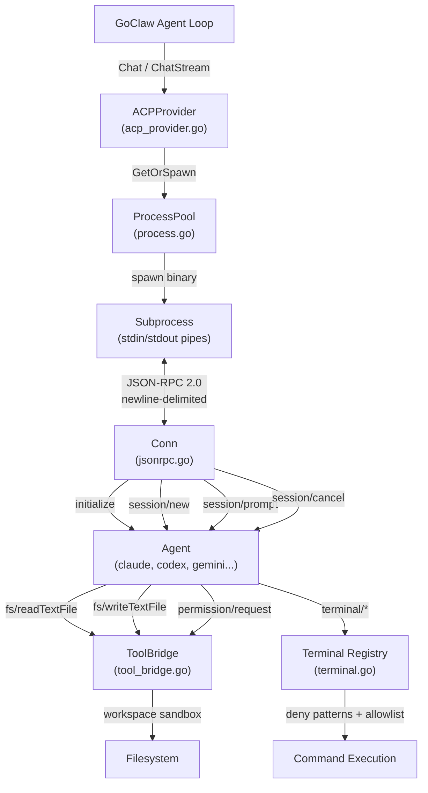
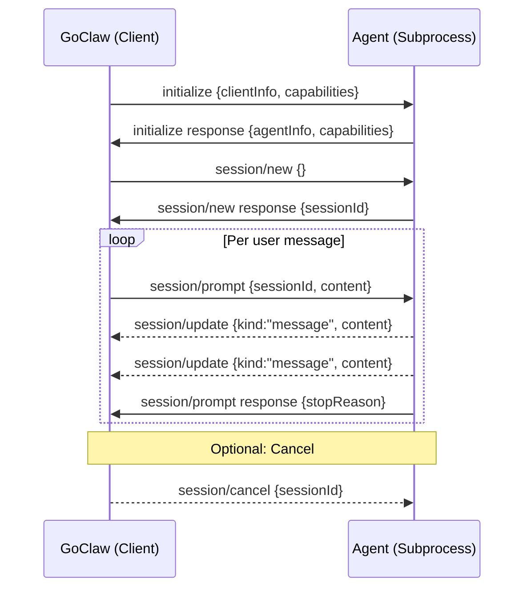

# 18 - ACP Provider (Agent Client Protocol)

The ACP provider enables GoClaw to orchestrate external coding agents (Claude Code, Codex CLI, Gemini CLI, Kiro, or any ACP-compatible agent) as subprocesses via JSON-RPC 2.0 over stdio. One provider covers all ACP agents through config-driven agent registry.

> **References:** [ACP Spec](https://agentclientprotocol.com/) · [ACP Schema](https://github.com/agentclientprotocol/agent-client-protocol/blob/main/schema/schema.json) · Issue [#189](https://github.com/nextlevelbuilder/goclaw/issues/189) · PR [#190](https://github.com/nextlevelbuilder/goclaw/pull/190)

---

## 1. Architecture



**Key principles:**
- GoClaw is an ACP **client** — it spawns and controls agent subprocesses
- Each subprocess is a long-lived OS process communicating via stdin/stdout
- Security enforced at the tool bridge layer: workspace sandboxing, deny patterns, permission modes

---

## 2. Wire Protocol: JSON-RPC 2.0 over Stdio

### Transport

Messages are **newline-delimited JSON** on stdin/stdout. Each message is a complete JSON object followed by `\n`. The `Conn` type (`jsonrpc.go`, 217 lines) handles bidirectional communication.

```
GoClaw (Client)                     Agent (Server)
     │                                    │
     │──── {"jsonrpc":"2.0","id":1,  ────►│  Request
     │      "method":"initialize",        │
     │      "params":{...}}               │
     │                                    │
     │◄─── {"jsonrpc":"2.0","id":1,  ─────│  Response
     │      "result":{...}}               │
     │                                    │
     │◄─── {"jsonrpc":"2.0",         ─────│  Notification (no id)
     │      "method":"session/update",    │
     │      "params":{...}}               │
     │                                    │
     │◄─── {"jsonrpc":"2.0","id":42, ─────│  Agent→Client Request
     │      "method":"fs/readTextFile",   │
     │      "params":{"path":"..."}}      │
     │                                    │
     │──── {"jsonrpc":"2.0","id":42, ────►│  Client→Agent Response
     │      "result":{"content":"..."}}   │
```

### Message Format

```go
type jsonrpcMessage struct {
    JSONRPC string          `json:"jsonrpc"`         // always "2.0"
    ID      *int64          `json:"id,omitempty"`    // present for requests/responses, absent for notifications
    Method  string          `json:"method,omitempty"`
    Params  json.RawMessage `json:"params,omitempty"`
    Result  json.RawMessage `json:"result,omitempty"`
    Error   *jsonrpcError   `json:"error,omitempty"`
}
```

### Key Conn Methods

| Method | Purpose |
|--------|---------|
| `Call(ctx, method, params, &result)` | Send request, block until response (with context timeout) |
| `Notify(method, params)` | Fire-and-forget notification |
| `Start()` | Spawn `readLoop` goroutine for incoming messages |
| `Done()` | Channel closed when read loop exits (process died) |

**Buffer sizing:** Scanner uses 256KB initial / 10MB max per message — handles large file contents in tool bridge responses.

**ID sequencing:** Atomic `Int64` counter, no lock contention.

---

## 3. Session Lifecycle



### Phase 1: Initialize

Client declares capabilities (filesystem read/write, terminal support). Agent responds with identity and capabilities (audio, image, embedded context).

```go
// Client sends:
InitializeRequest{
    ClientInfo: ClientInfo{Name: "goclaw", Version: "1.0"},
    Capabilities: ClientCaps{
        Fs:       &FsCaps{Read: true, Write: true},
        Terminal: &TerminalCaps{Create: true},
    },
}
```

### Phase 2: New Session

Creates an isolated session on the agent. Returns `sessionId` used in all subsequent prompt calls.

### Phase 3: Prompt Loop

Send user content blocks (text + images). Agent streams `session/update` notifications with message deltas, tool call progress, and plan updates. Prompt completes with a response containing `stopReason`.

### Phase 4: Cancel (Optional)

Cooperative cancellation via `session/cancel` notification. Agent may take time to stop.

---

## 4. Content Handling

### ContentBlock Types

```go
type ContentBlock struct {
    Type     string `json:"type"`               // "text", "image", "audio"
    Text     string `json:"text,omitempty"`      // text content
    Data     string `json:"data,omitempty"`      // base64 for image/audio
    MimeType string `json:"mimeType,omitempty"`  // e.g. "image/png"
}
```

### Request Extraction (GoClaw → Agent)

1. Extract system prompt + user message from `ChatRequest.Messages`
2. Prepend system prompt to first user message (ACP has no separate system message API)
3. Attach images as separate content blocks with base64 data

### Response Collection (Agent → GoClaw)

1. Accumulate `SessionUpdate` notifications during prompt execution
2. Collect text blocks into response content string
3. Map `stopReason` to GoClaw finish reason:
   - `"maxContextLength"` → `"length"`
   - All others → `"stop"`

### SessionUpdate Structure

```go
type SessionUpdate struct {
    Kind    string         `json:"kind"`    // "message", "toolCall", "plan"
    Content []ContentBlock `json:"content,omitempty"`
    ToolCall *ToolCallUpdate `json:"toolCall,omitempty"`
}

type ToolCallUpdate struct {
    ID      string         `json:"id"`
    Name    string         `json:"name"`
    Status  string         `json:"status"`  // "running", "completed"
    Content []ContentBlock `json:"content,omitempty"`
}
```

---

## 5. Process Pool

`ProcessPool` (`process.go`, 237 lines) manages subprocess lifecycle.

### Spawn Flow

```
GetOrSpawn(sessionKey)
  ├→ Check cached process (sync.Map)
  │   └→ Found + alive → return
  ├→ Acquire per-key spawn mutex (prevent thundering herd)
  └→ spawn():
      ├→ exec.Command(binary, args...)
      ├→ cmd.Env = filterACPEnv(os.Environ())  // strip secrets
      ├→ Create stdin/stdout pipes
      ├→ cmd.Stderr = limitedWriter(4KB)
      ├→ cmd.Start()
      ├→ NewConn(stdin, stdout, toolBridge.Handle, notifyHandler)
      ├→ conn.Start()  // begin readLoop
      ├→ Initialize()  // ACP handshake
      ├→ NewSession()  // create session
      ├→ Monitor exit in background goroutine
      └→ Store in pool
```

### Idle Reaping

Every 30 seconds, the reaper checks all processes:

```go
for each process in pool:
    if process.inUse > 0: skip          // active prompt running
    if time.Since(lastActive) > idleTTL:
        process.cmd.Process.Kill()       // SIGKILL
        remove from pool
```

### Crash Recovery

If a process exits unexpectedly (detected via `<-proc.exited` channel), the next `GetOrSpawn` call automatically spawns a replacement. The active prompt is lost — caller receives an error.

### Concurrency Controls

| Mechanism | Purpose |
|-----------|---------|
| `sync.Map` for processes | Lock-free concurrent access |
| Per-key spawn mutex | Prevent duplicate spawns for same session |
| `inUse` atomic flag | Reaper skips active processes |
| `lastActive` timestamp | Tracks idle time for reaping |
| Session-level mutex in ACPProvider | Serializes prompts per session |

---

## 6. Tool Bridge (Agent → Client Requests)

`ToolBridge` (`tool_bridge.go`, 204 lines) handles all agent-initiated requests with security enforcement.

### Request Routing

| Method | Handler | Description |
|--------|---------|-------------|
| `fs/readTextFile` | `readFile()` | Read file within workspace |
| `fs/writeTextFile` | `writeFile()` | Write file within workspace |
| `terminal/createTerminal` | `createTerminal()` | Spawn command subprocess |
| `terminal/terminalOutput` | `terminalOutput()` | Get current output |
| `terminal/waitForTerminalExit` | `waitForExit()` | Block until exit (10-min timeout) |
| `terminal/releaseTerminal` | `releaseTerminal()` | Clean up resources |
| `terminal/killTerminal` | `killTerminal()` | Force-terminate |
| `permission/request` | `handlePermission()` | Permission check |

### Permission Modes

| Mode | Reads | Writes | Terminal | Permission Requests |
|------|-------|--------|----------|-------------------|
| `approve-all` | ✅ | ✅ | ✅ | ✅ (default) |
| `approve-reads` | ✅ | ❌ | ❌ | Per-type |
| `deny-all` | ❌ | ❌ | ❌ | ❌ |

### Workspace Sandbox

All file paths validated via `resolvePath()`:

```go
func resolvePath(path string) (string, error) {
    abs := filepath.Join(workspace, path)
    real, _ := filepath.EvalSymlinks(abs)  // resolve symlinks
    if !strings.HasPrefix(real, workspace) {
        slog.Warn("security.acp_path_escape", ...)
        return "", fmt.Errorf("path outside workspace")
    }
    return real, nil
}
```

Symlink resolution prevents `../../etc/passwd` attacks even when symlinks point outside workspace.

---

## 7. Terminal System

`Terminal` (`terminal.go`, 212 lines) manages command execution within the tool bridge.

### Security Layers

**1. Binary Allowlist (63 binaries):**
```
sh, bash, zsh, fish, node, npm, npx, pnpm, yarn, bun, deno,
python, python3, pip, pip3, uv, ruby, gem, go, cargo, rustc,
java, javac, mvn, gradle, dotnet, git, gh, docker, kubectl,
make, cmake, gcc, g++, clang, curl, wget, jq, yq, tar, zip,
unzip, gzip, cat, head, tail, less, grep, rg, find, ls, mv,
cp, mkdir, rm, chmod, touch, sed, awk, sort, wc, diff, tee
```

**2. Deny Patterns:** Regex patterns from GoClaw's `DefaultDenyPatterns` are applied to the full command string (binary + args).

**3. Working Directory Sandbox:** Terminal `cwd` validated against workspace boundary.

### cappedBuffer

Thread-safe circular buffer that retains only the last N bytes (default 10MB):

```go
type cappedBuffer struct {
    mu   sync.Mutex
    data []byte
    max  int
}
// On overflow: keeps tail (recent output), discards head
```

Used for both stdout and stderr capture. Prevents unbounded memory growth from verbose agent output.

---

## 8. Environment Filtering

Before spawning any agent subprocess, `filterACPEnv()` strips sensitive environment variables:

**Prefix-based (12 prefixes):**
```
GOCLAW_, CLAUDE_, ANTHROPIC_, OPENAI_, DATABASE_, AWS_,
GOOGLE_, AZURE_, GITHUB_, DOCKER_, STRIPE_, SSH_
```

**Exact-match (15 keys):**
```
DB_DSN, PGPASSWORD, PGUSER, PGHOST, PGDATABASE, PGPORT,
REDIS_URL, MONGO_URI, NPM_TOKEN, SENTRY_AUTH_TOKEN,
SENTRY_DSN, DATADOG_API_KEY, TWILIO_AUTH_TOKEN,
SENDGRID_API_KEY, SLACK_TOKEN
```

This prevents credential leakage to untrusted agent binaries.

---

## 9. Configuration

### Config File (config.json)

```json5
{
  "providers": {
    "acp": {
      "binary": "claude",        // agent binary (must be in PATH)
      "args": ["--profile", "goclaw"],  // optional spawn args
      "model": "claude",         // default model name for routing
      "work_dir": "/workspace",  // base workspace directory
      "idle_ttl": "5m",          // process idle timeout
      "perm_mode": "approve-all" // "approve-all" | "approve-reads" | "deny-all"
    }
  }
}
```

### Database Registration

Create via Providers API or Web UI:

| Field | Value |
|-------|-------|
| `provider_type` | `"acp"` |
| `api_base` | Binary name or absolute path (`"claude"`, `"/usr/local/bin/codex"`) |
| `settings` | `{"args": [...], "idle_ttl": "5m", "perm_mode": "approve-all", "work_dir": "..."}` |

Binary validation: Only `claude`, `codex`, `gemini`, or absolute paths are accepted for DB-based registration. Verified via `exec.LookPath()`.

### Gateway Wiring

```go
// Config-based: resolved at startup
registerACPFromConfig(registry, cfg.Providers.ACP)

// DB-based: resolved from llm_providers table
registerACPFromDB(registry, providerData)
```

Both paths:
1. Verify binary exists via `exec.LookPath`
2. Parse `IdleTTL` duration
3. Resolve `WorkDir` (default: `~/.goclaw/acp-workspaces`)
4. Create `NewACPProvider(binary, args, workDir, idleTTL, denyPatterns, opts...)`

### Live Reload

DB-based providers support live reload via pubsub. When a provider is created/updated/deleted in the Web UI, a `cache.invalidate` event triggers re-registration without gateway restart.

---

## 10. Streaming vs Non-Streaming

### Chat (Non-Streaming)

```go
func (p *ACPProvider) Chat(ctx, req) → *ChatResponse
```

1. Lock session mutex
2. `GetOrSpawn` process
3. `Prompt(content, onUpdate)` — blocks until complete
4. Collect all text deltas into `strings.Builder`
5. Return `ChatResponse{Content: text, FinishReason: mapped}`

### ChatStream

```go
func (p *ACPProvider) ChatStream(ctx, req, onChunk) → *ChatResponse
```

1. Lock session mutex
2. Set up cancel listener (`session/cancel` on context cancellation)
3. `GetOrSpawn` process
4. `Prompt(content, onUpdate)` with callback:
   - Extract text blocks from each `SessionUpdate`
   - Emit `StreamChunk{Content: delta}` via `onChunk`
5. On completion: emit `StreamChunk{Done: true}`
6. Return accumulated `ChatResponse`

---

## 11. Error Handling

| Scenario | Behavior |
|----------|----------|
| Binary not found | Log warning, skip provider registration |
| Subprocess crash mid-prompt | Active prompt fails; next `GetOrSpawn` respawns |
| Malformed JSON-RPC | Log debug, skip message, continue reading |
| Path escape attempt | Log `security.acp_path_escape`, return error to agent |
| Terminal binary not in allowlist | Return error to agent |
| Terminal deny pattern match | Return error to agent |
| Context cancelled (ChatStream) | Send `session/cancel`, return partial response |
| Idle timeout | Reaper kills process; respawned on next request |
| Permission denied | Return error based on `perm_mode` |
| Large output (>10MB terminal) | cappedBuffer retains tail only |

---

## 12. File Reference

| File | Lines | Purpose |
|------|-------|---------|
| `internal/providers/acp_provider.go` | 227 | Provider interface: Chat, ChatStream, content extraction |
| `internal/providers/acp/types.go` | 189 | ACP protocol types: Initialize, Session, ContentBlock |
| `internal/providers/acp/jsonrpc.go` | 217 | Bidirectional JSON-RPC 2.0 over stdio |
| `internal/providers/acp/process.go` | 237 | Subprocess pool: spawn, reap, crash recovery |
| `internal/providers/acp/session.go` | 71 | Session lifecycle: init → new → prompt → cancel |
| `internal/providers/acp/tool_bridge.go` | 204 | Agent→client request handler with sandbox |
| `internal/providers/acp/terminal.go` | 212 | Terminal subprocess lifecycle + cappedBuffer |
| `internal/providers/acp/helpers.go` | 81 | Environment filtering, limitedWriter |
| `internal/config/config_channels.go` | — | `ACPConfig` struct definition |
| `internal/store/provider_store.go` | — | `ProviderACP = "acp"` constant |
| `cmd/gateway_providers.go` | — | Config + DB registration wiring |

---

## Cross-References

| Document | Relevant Content |
|----------|-----------------|
| [02-providers.md](./02-providers.md) | ACP overview section (§10) |
| [03-tools-system.md](./03-tools-system.md) | Shell deny patterns reused by ToolBridge |
| [09-security.md](./09-security.md) | Defense-in-depth layers |
| [01-agent-loop.md](./01-agent-loop.md) | Chat/ChatStream provider contract |
