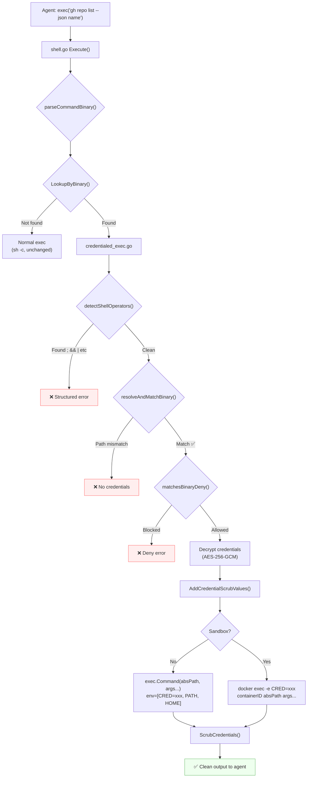
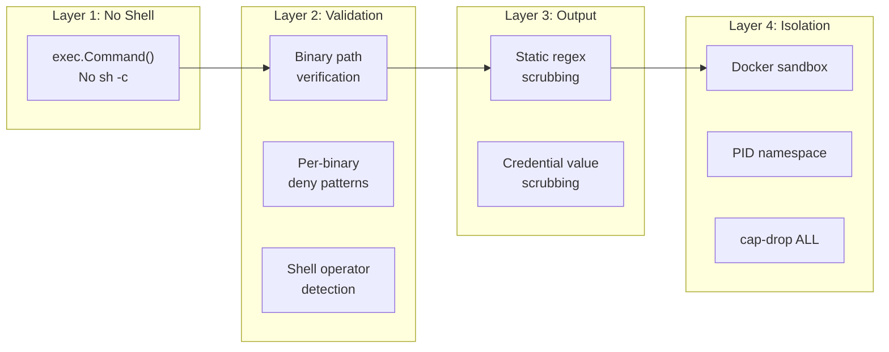

# 19 - Credentialed Exec

Credentialed Exec allows GoClaw agents to use external CLI tools (`gh`, `gcloud`, `aws`, `kubectl`, `terraform`) with auto-injected credentials. Credentials are encrypted at rest and injected directly into child processes via Direct Exec Mode — never exposed to the LLM, never passed through a shell.

> **References:** Issue [#197](https://github.com/nextlevelbuilder/goclaw/issues/197) · PR [#199](https://github.com/nextlevelbuilder/goclaw/pull/199)

---

## 1. Architecture



**Key principle:** When credentials are present, commands run via `exec.Command(binary, args...)` — **no shell** (`sh -c`). This eliminates shell injection entirely because `;`, `&&`, `|`, `$()`, backticks have no special meaning without a shell interpreter.

---

## 2. Security Model: Defense-in-Depth

Four independent layers protect credentials. Even if one layer is bypassed, remaining layers continue to protect.



### Edge Cases Analyzed (13 total)

| # | Edge Case | Severity | Mitigation |
|---|-----------|----------|------------|
| 1 | **Shell command chaining** (`; && \|\| \|`) | 🔴 CRITICAL | Direct Exec Mode — no shell interpreter |
| 2 | Lost shell features (pipes, redirects) | 🟡 | Structured output flags (`--json`) + separate calls |
| 3 | Binary name spoofing (`./gh`) | 🟡 | Absolute path resolution via `exec.LookPath` + config match |
| 4 | Dynamic binary resolution (`$(which gh)`) | 🟢 | Blocked by Direct Exec — `$()` is literal |
| 5 | Multiple binaries (`gh && curl`) | 🟢 | Blocked by Direct Exec — `&&` is literal |
| 6 | `/proc/PID/environ` cross-read | 🟡 | Docker PID namespace + deny pattern |
| 7 | Debug/verbose output leaking creds | 🟡 | Per-binary `deny_verbose` patterns + scrubbing |
| 8 | Temp file credential exposure | 🟡 | Pipe fd injection (Linux), temp file (Windows) |
| 9 | strace/ltrace/gdb | 🟢 | Docker `cap-drop ALL` + deny patterns |
| 10 | CLI config file access | 🟢 | PathDenyable + Docker sandbox |
| 11 | Multi-tenant scope mismatch | 🟡 | Per-agent + global DB scoping with priority |
| 12 | Binary not found | 🟢 | Startup validation via `exec.LookPath` |
| 13 | Credential rotation window | 🟢 | Short-lived child processes (no caching) |

---

## 3. Database Schema

**Table:** `secure_cli_binaries` (Migration 000019)

```sql
CREATE TABLE secure_cli_binaries (
    id              UUID PRIMARY KEY DEFAULT uuid_generate_v7(),
    binary_name     TEXT NOT NULL,           -- "gh", "gcloud", "aws"
    binary_path     TEXT,                    -- resolved absolute path (nullable)
    description     TEXT NOT NULL DEFAULT '',
    encrypted_env   BYTEA NOT NULL,          -- AES-256-GCM encrypted JSON
    deny_args       JSONB NOT NULL DEFAULT '[]',    -- regex deny patterns
    deny_verbose    JSONB NOT NULL DEFAULT '[]',    -- verbose flag patterns
    timeout_seconds INTEGER NOT NULL DEFAULT 30,
    tips            TEXT NOT NULL DEFAULT '',
    agent_id        UUID REFERENCES agents(id) ON DELETE CASCADE,
    enabled         BOOLEAN NOT NULL DEFAULT true,
    created_by      TEXT NOT NULL DEFAULT '',
    created_at      TIMESTAMPTZ NOT NULL DEFAULT now(),
    updated_at      TIMESTAMPTZ NOT NULL DEFAULT now()
);
```

**Scoping:** `agent_id = NULL` means global (all agents). Agent-specific configs take priority over global via `ORDER BY agent_id NULLS LAST LIMIT 1`.

**Encryption:** `encrypted_env` stores AES-256-GCM encrypted JSON (e.g., `{"GH_TOKEN":"ghp_xxx"}`). Encrypted by `PGSecureCLIStore` on write, decrypted on read. Uses `aes-gcm:` prefix convention matching `llm_providers`.

---

## 4. Store Layer

### Interface (`internal/store/secure_cli_store.go`)

```go
type SecureCLIStore interface {
    Create(ctx, *SecureCLIBinary) error
    Get(ctx, id) (*SecureCLIBinary, error)
    Update(ctx, id, map[string]any) error
    Delete(ctx, id) error
    List(ctx) ([]SecureCLIBinary, error)
    ListByAgent(ctx, agentID) ([]SecureCLIBinary, error)
    LookupByBinary(ctx, binaryName, *agentID) (*SecureCLIBinary, error)  // priority lookup
    ListEnabled(ctx) ([]SecureCLIBinary, error)  // for TOOLS.md context
}
```

### Lookup Priority

`LookupByBinary` returns the best match:
1. Agent-specific config (exact `agent_id` match)
2. Global config (`agent_id IS NULL`)
3. `nil` if no match

---

## 5. Direct Exec Engine

### Core File: `internal/tools/credentialed_exec.go`

#### Command Parsing

Uses `github.com/mattn/go-shellwords` for proper shell-word tokenization:

```go
parseCommandBinary("gh issue create --title \"Fix the bug\"")
→ binary: "gh", args: ["issue", "create", "--title", "Fix the bug"]
```

Handles: quoted strings, escaped characters, `=` signs, empty strings.

#### Shell Operator Detection

Regex detects metacharacters **before** execution:

```go
var shellOperatorPattern = regexp.MustCompile(`[;|&<>\n\r` + "`" + `]|\$\(|\$\{`)
```

Detected operators: `;` `|` `&` `<` `>` `` ` `` `\n` `\r` `$(` `${`

Returns structured error with clear guidance:
```
[CREDENTIALED EXEC] Shell operators not supported.
Detected: ;
This CLI runs in Direct Exec Mode — no shell operators.
Run the command without operators. Use --json for structured output.
```

#### Binary Path Verification

```go
resolveAndMatchBinary("gh", configPath)
  → exec.LookPath("gh") → "/usr/bin/gh"
  → if configPath != nil && "/usr/bin/gh" != configPath → error
  → return "/usr/bin/gh"
```

Prevents binary spoofing: `./gh` (workspace) resolves to different path than `/usr/bin/gh` (system).

#### Per-Binary Deny Patterns

Args joined as string, matched against regex patterns from `deny_args` and `deny_verbose`:

```go
// deny_args: ["auth\\s+", "ssh-key", "repo\\s+delete"]
matchesBinaryDeny(["auth", "login"], denyArgs) → "auth\\s+" (blocked)
matchesBinaryDeny(["repo", "list"],  denyArgs) → "" (allowed)
```

#### Execution Paths

**Host mode:**
```go
cmd := exec.Command(absPath, args...)
cmd.Env = [PATH=..., HOME=..., LANG=..., USER=..., GH_TOKEN=xxx]
cmd.Dir = workspace
```

**Sandbox mode:**
```go
sb.Exec(ctx, []string{absPath, args...}, cwd, sandbox.WithEnv(envMap))
// → docker exec -e GH_TOKEN=xxx containerID /usr/bin/gh repo list --json name
```

### Approval Bypass

Credentialed binaries auto-bypass `ExecApprovalManager`. Rationale: admin configuring credentials = implicit approval for that binary. Lookup happens BEFORE approval check in `shell.go Execute()`.

---

## 6. Credential Scrubbing

Two-tier scrubbing via `internal/tools/scrub.go`:

### Static Patterns (11 regexes)
Pre-compiled patterns for known credential formats: `sk-*`, `ghp_*`, `AKIA*`, connection strings, etc.

### Dynamic Credential Values
```go
AddCredentialScrubValues("ghp_xxxx...")  // registered on decrypt
```

Values replaced with `[REDACTED]` in all tool output (both `ForLLM` and `ForUser`). Thread-safe, deduplicated, minimum length 6 to avoid false positives.

---

## 7. TOOLS.md Context Injection

`GenerateCredentialContext()` (`credential_context.go`) builds a system prompt supplement appended after the `## Tooling` section. This tells the LLM:

- Which CLIs are available with pre-configured auth
- That these CLIs run in Direct Exec Mode (no shell operators)
- Which operations are blocked per CLI
- How to handle blocked operations

```markdown
## Credentialed CLI Tools

The following CLI tools have pre-configured authentication.
Credentials are injected automatically — do NOT attempt to provide or read credentials.

⚠️ CRITICAL: These tools run in DIRECT EXEC MODE (no shell).
- Do NOT use shell operators: ;  &&  ||  |  >  >>  <  $()  ``
- Each exec() call runs ONE command only
- Use --json or --format=json for structured output

### Available CLIs:

**gh** — GitHub CLI
  Blocked: auth, ssh-key, gpg-key, repo delete, secret
  Tip: Use --json flag for structured output
```

**UX impact:** Eliminates agent retry loops caused by mode confusion. Agent knows to use `--json` flags and avoid pipes.

---

## 8. Built-in CLI Presets

5 presets in `credential_presets.go` — auto-fill env vars, deny patterns, timeout, tips:

| Preset | Env Vars | Deny Patterns | Timeout |
|--------|----------|---------------|---------|
| `gh` | `GH_TOKEN` | `auth\s+`, `ssh-key`, `gpg-key`, `repo\s+delete`, `secret\s+` | 30s |
| `gcloud` | `GOOGLE_APPLICATION_CREDENTIALS` (file) | `iam\s+`, `auth\s+`, `projects\s+delete`, `services\s+disable`, `kms\s+` | 120s |
| `aws` | `AWS_ACCESS_KEY_ID`, `AWS_SECRET_ACCESS_KEY`, `AWS_DEFAULT_REGION` (opt) | `iam\s+`, `organizations\s+`, `sts\s+assume`, `ec2\s+terminate` | 60s |
| `kubectl` | `KUBECONFIG` (file) | `delete\s+namespace`, `delete\s+node`, `drain\s+`, `cordon\s+` | 60s |
| `terraform` | `TF_TOKEN_app_terraform_io` (opt) | `destroy`, `force-unlock` | 300s |

API: `POST /v1/cli-credentials {"preset": "gh", "env": {"GH_TOKEN": "ghp_xxx"}}` auto-fills all preset fields.

---

## 9. HTTP API

| Method | Path | Description |
|--------|------|-------------|
| `GET` | `/v1/cli-credentials` | List all (env masked) |
| `POST` | `/v1/cli-credentials` | Create (supports `preset` field) |
| `GET` | `/v1/cli-credentials/presets` | List available presets |
| `GET` | `/v1/cli-credentials/{id}` | Get single (env masked) |
| `PUT` | `/v1/cli-credentials/{id}` | Update (field allowlisted) |
| `DELETE` | `/v1/cli-credentials/{id}` | Delete |
| `POST` | `/v1/cli-credentials/{id}/test` | Dry run commands against deny patterns |

**Security:** Credentials (`encrypted_env`) are NEVER returned in API responses. `EncryptedEnv = nil` set explicitly in all GET handlers. Update handler uses field allowlist to prevent column injection.

### Dry Run

Test commands against deny patterns before deploying:

```json
POST /v1/cli-credentials/{id}/test
{"test_commands": ["gh repo list", "gh auth login", "gh repo delete x"]}

→ {"results": [
    {"command": "gh repo list",     "allowed": true,  "matched_deny": null},
    {"command": "gh auth login",    "allowed": false, "matched_deny": "auth\\s+"},
    {"command": "gh repo delete x", "allowed": false, "matched_deny": "repo\\s+delete"}
  ]}
```

---

## 10. Sandbox Integration

### ExecOption Pattern

`sandbox.Exec()` extended with variadic options:

```go
type ExecOption func(*ExecOpts)
func WithEnv(env map[string]string) ExecOption

// Usage:
sb.Exec(ctx, []string{"/usr/bin/gh", "repo", "list"}, "/workspace",
    sandbox.WithEnv(map[string]string{"GH_TOKEN": "ghp_xxx"}))

// Translates to:
// docker exec -e GH_TOKEN=ghp_xxx -w /workspace <containerID> /usr/bin/gh repo list
```

**Important:** Env vars injected via `docker exec -e` are NOT accessible to other processes in the container (unlike container-level env vars). This provides per-command isolation.

---

## 11. Web UI

**Page:** `ui/web/src/pages/cli-credentials/`

Features:
- CRUD table with binary name, description, enabled badge, agent scope, timeout
- Form dialog with preset selector dropdown
- When preset selected → auto-fills all fields, shows env var inputs (password type)
- Dry run panel for testing commands against deny patterns
- Sidebar navigation under System group with `KeyRound` icon

---

## 12. Structured Error Messages

Three error types returned to the LLM with clear context:

| Error Type | Trigger | LLM Guidance |
|------------|---------|-------------|
| Shell operator | `;`, `\|`, `&&`, etc. detected | "Remove operators, use `--json`" |
| Deny pattern | Command matches `deny_args`/`deny_verbose` | "Requires admin approval" |
| Exec failure | Non-zero exit code | "Direct Exec Mode, no shell operators" |

All errors include `[CREDENTIALED EXEC]` prefix for LLM pattern recognition. `ForUser` field provides concise user-facing message.

---

## 13. File Reference

| File | Lines | Purpose |
|------|-------|---------|
| `migrations/000019_secure_cli_binaries.up.sql` | 24 | Database table + indexes |
| `internal/store/secure_cli_store.go` | 45 | Store interface + `SecureCLIBinary` type |
| `internal/store/pg/secure_cli.go` | 210 | PostgreSQL CRUD + `LookupByBinary` |
| `internal/tools/credentialed_exec.go` | 260 | Direct Exec engine: parse, validate, execute |
| `internal/tools/credential_presets.go` | 100 | 5 CLI presets: gh, gcloud, aws, kubectl, terraform |
| `internal/tools/credential_context.go` | 70 | TOOLS.md context generator |
| `internal/tools/scrub.go` | 120 | Credential scrubbing (`AddCredentialScrubValues`) |
| `internal/http/secure_cli.go` | 270 | HTTP CRUD + presets + dry run |
| `internal/sandbox/sandbox.go` | — | `ExecOption`, `WithEnv()` |
| `internal/sandbox/docker.go` | — | `docker exec -e` env injection |
| `internal/agent/systemprompt.go` | — | `CredentialCLIContext` injection |

---

## Cross-References

| Document | Relevant Content |
|----------|-----------------|
| [03-tools-system.md](./03-tools-system.md) | Credentialed CLI Tools section under Shell Exec |
| [09-security.md](./09-security.md) | Credentialed Exec under Layer 3: Tool Security |
| [06-store-data-model.md](./06-store-data-model.md) | Store interface pattern |
| [17-changelog.md](./17-changelog.md) | Feature entry |
